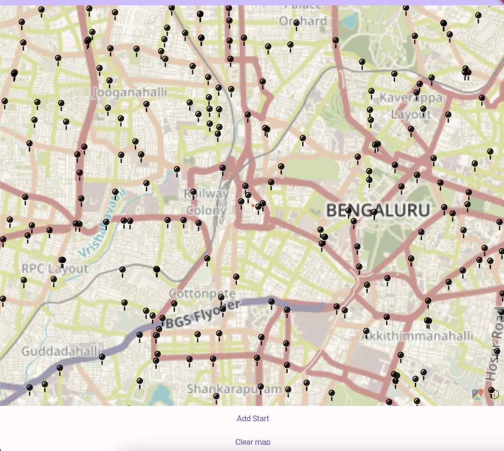
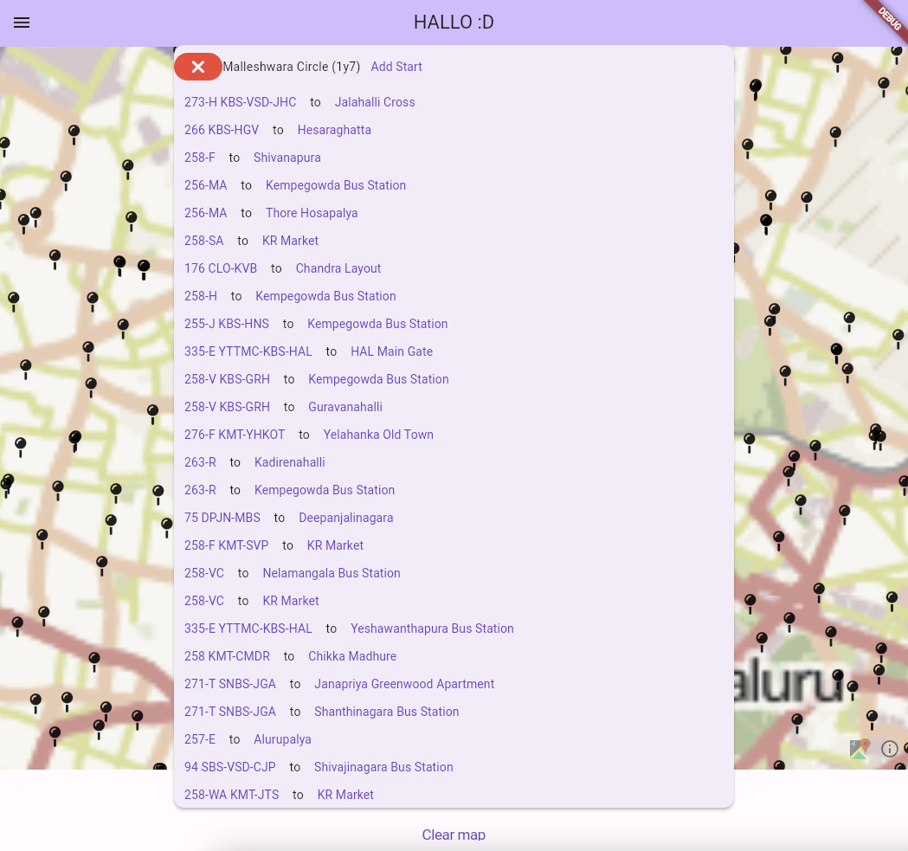
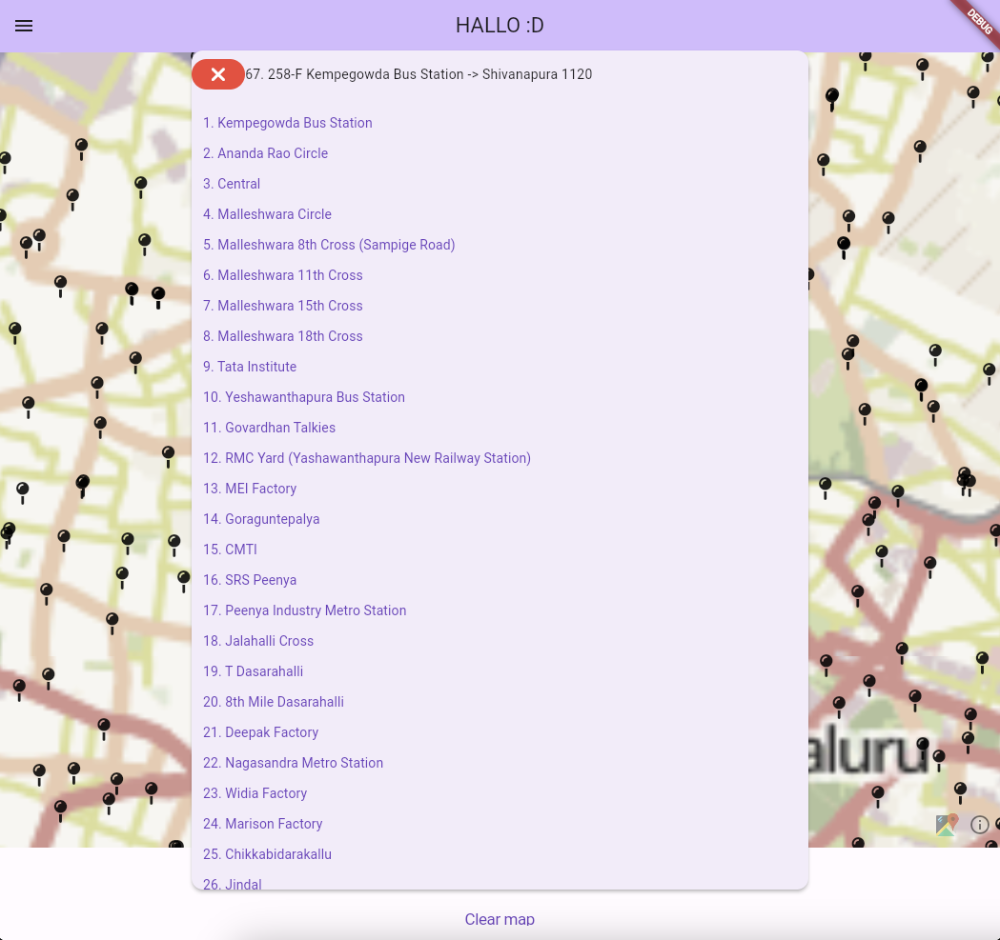
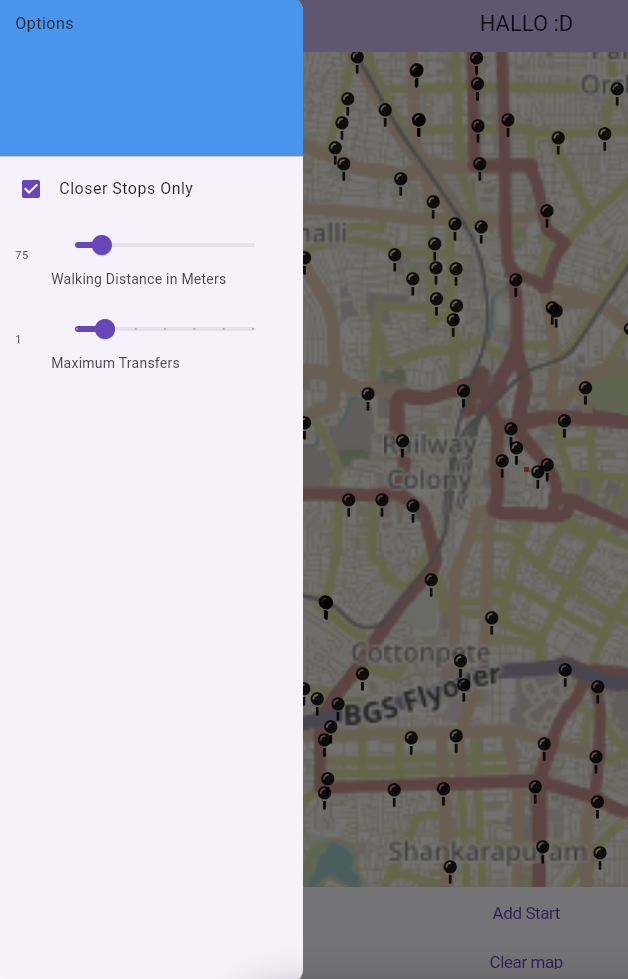
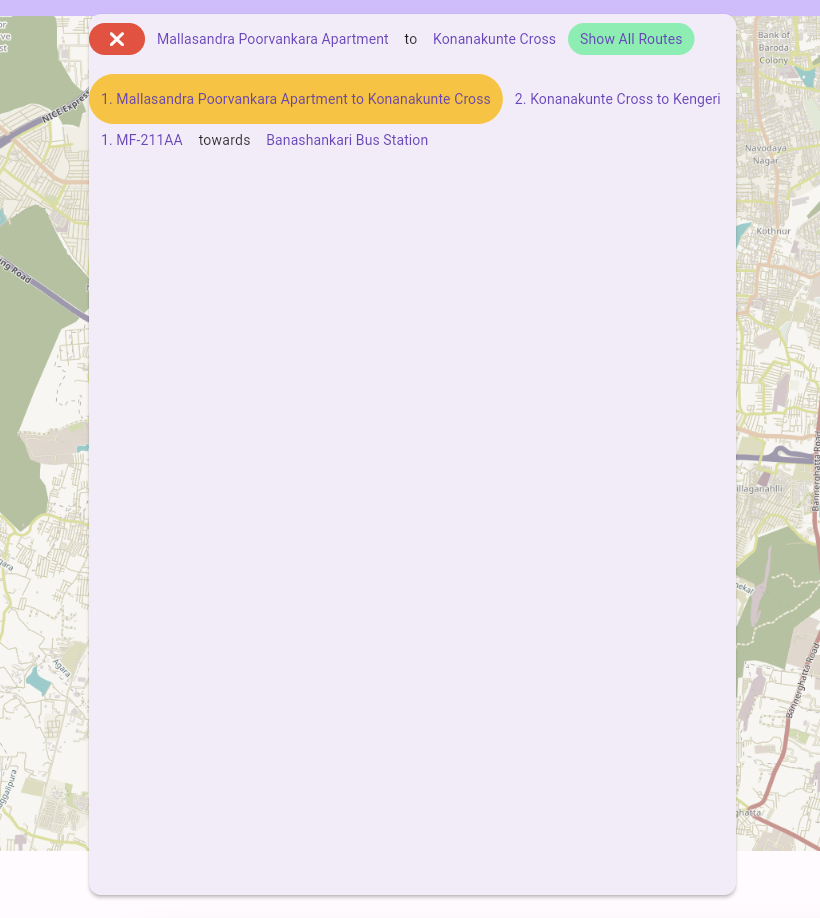
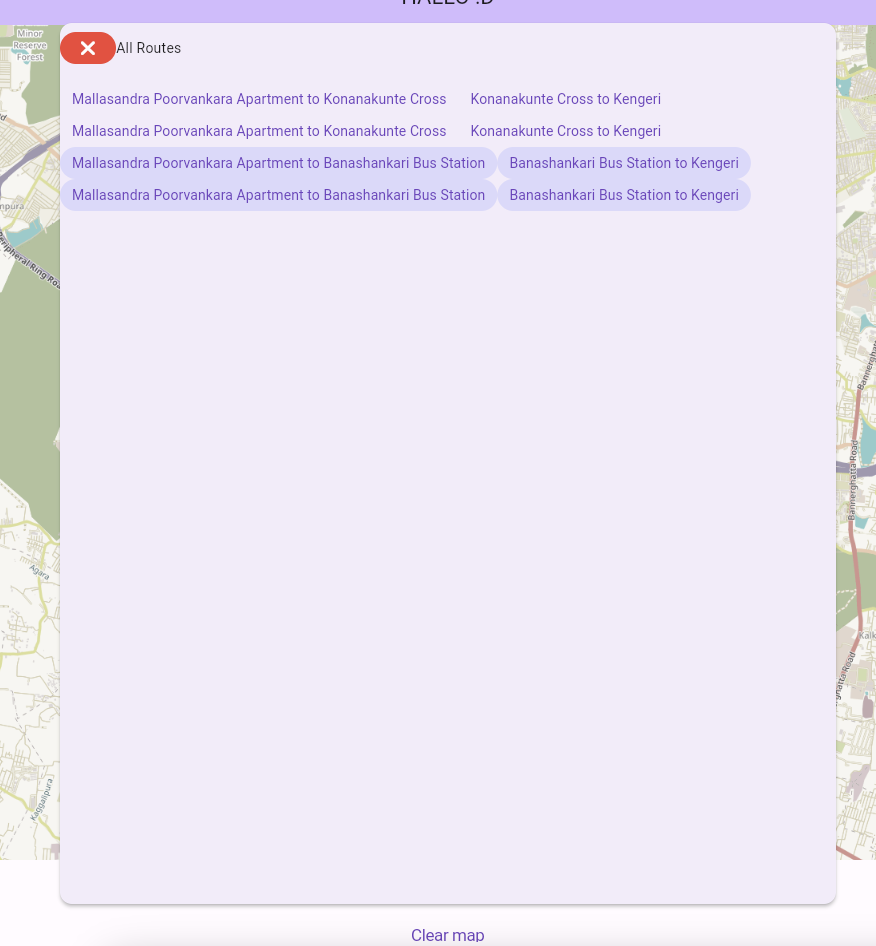
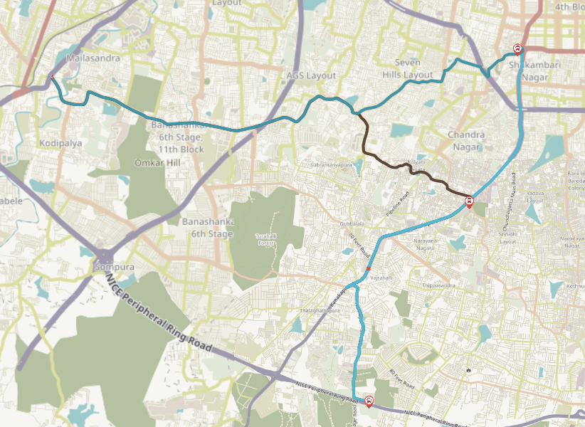

# bangalore_transit_app

A highly unoptimized unusable application built in flutter. The goal of this application is to find all possible (metro / bus) lines and transfers from point a to point b. It is not optimised and needs to be fiddled with to be used on a functional basis.

- Data for BMTC from [Vonter github repo](https://github.com/Vonter/bmtc-gtfs)
- Data for Namma Metro (BMRCL) from [geohacker github repo](https://github.com/geohacker/namma-metro?)

## Images from the application

###### 1. All stops overlayed on the map:

This overlay is slightly inaccurate due to icon offset, the more you zoom in the more accurate it gets. If it does not show the stops on the map initially please reload the map with the "Clear Map" button. These stops are clickable to get screen 2.

###### 2. Stop overview / information:

This lists all the routes touching this stop. The "Add Start" button is used to add a start / end to a journey. The routes are clickable to get screen 3, and the stops are also clickable to get the same screen of that stop.

###### 3. Route overview / information:

This lists all the stops this route touches. The stops are clickable to get screen 2.

###### 4. Options sidebar:

Closer stops only means only stops that are geographically closer to the destination will be counted for transfers, this prevents transfers such as Majestic > Banashankari > KR Market but also prevents viable edge cases at the moment (see To-Do)

###### 5. Journey Overview / information:

The journey is from Mallasandra Apartment to Kengeri, the leg of the journey is Mallasandra Apartment to Konanakunte Cross. 

###### 6. Journeys Overview:

This screen currently gets duplicated results, need to fine-tune and fix this. This lists all the possible journeys from "start" to "end".

###### 7. Journeys overlayed on the map:

The blue line is via Banashankari and the brown line is via Konanakunte Cross, these lines are clickable to get screen 5.

# To-Do

### (in no particular order)

- [ ] Use sharedprefs for Maximum Transfers, Walking Distance
- [ ] Prevent duplicate journeys in getRoutes
- [ ] Use route polylines for distance, not actual geographical distance (for closer stops setting)
- [ ] Use OSRM or something similar for getNearbyStops, and walk polyline
- [ ] Implement a local database for data storage as opposed to the current (always reading from) geojson implementation
- [ ] Modify metro data to be able to be parsed correctly by application
- [ ] Parse geojson info into the application more accurately (relations between stops and routes are a bit goofy at the moment)
- [ ] Store timing information where available to display as well
- [ ] SIFT THROUGH AND CLEAN GTFS DATA!!!
